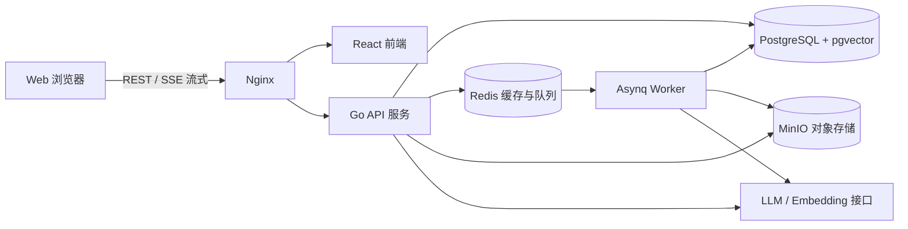

# AtlasDesk 智能服务工作台

AtlasDesk 是一个专为企业内部员工与客服团队设计的智能服务工作台，融合企业知识库、带精确引用的 RAG 问答及智能工单流转平台。

## 核心架构与技术栈

- **前端 Web**：React 18 + TypeScript + Vite + Tailwind CSS + TanStack Query + Zustand
- **后端 API 与 Worker**：Go 1.25 + Gin + GORM + pgx + Asynq
- **存储与索引**：PostgreSQL (pgvector 扩展) + Redis + MinIO (S3 兼容对象存储)
- **容器与部署**：Docker Compose + Nginx



## 快速启动指南

### 1. 环境准备
确保本机安装了以下工具：
- Go >= 1.22
- Node.js >= 18 与 npm
- Docker 及 Docker Compose（或本机独立运行 PostgreSQL、Redis、MinIO）

### 2. 准备环境变量
```bash
cp .env.example .env
```

### 3. 启动本地基础设施 (Docker Compose)
```bash
make docker-up
# 或：docker compose -f deploy/docker-compose.yml up -d
```
> 注：容器包含 PostgreSQL (端口 5432，已启用 pgvector)、Redis (端口 6379)、MinIO (API 端口 9000，控制台端口 9001)。

### 4. 启动后端 API 服务
```bash
make dev-server
# 或：cd server && go run cmd/api/main.go
```
服务默认监听在 `http://localhost:8080`。
健康检查探测地址：
- 存活探针：`http://localhost:8080/health/live`
- 就绪探针：`http://localhost:8080/health/ready`

### 5. 启动前端界面
```bash
make dev-web
# 或：cd web && npm install && npm run dev
```
前端默认运行在 `http://localhost:5173`。

## 目录结构说明

```
atlasdesk/
├── web/                 # 前端应用 (React + Vite + TypeScript)
├── server/              # 后端应用 (Go API 与 Asynq Worker)
│   ├── cmd/             # 服务启动入口 (api, worker)
│   ├── internal/        # 核心业务领域与分层逻辑
│   └── migrations/      # 数据库迁移脚本
├── deploy/              # 本地容器编排与 Nginx 配置
├── docs/                # 产品规范、开发进度与架构设计文档
├── .env.example         # 环境变量示例模板
├── Makefile             # 工程自动化运维脚本
└── README.md            # 项目说明与入门指南
```

## 开发规范与进度
详细开发规范与验收标准请参考 [docs/AGENT_IMPLEMENTATION_SPEC.md](docs/AGENT_IMPLEMENTATION_SPEC.md)。
最新开发进度请查阅 [docs/PROGRESS.md](docs/PROGRESS.md)。
